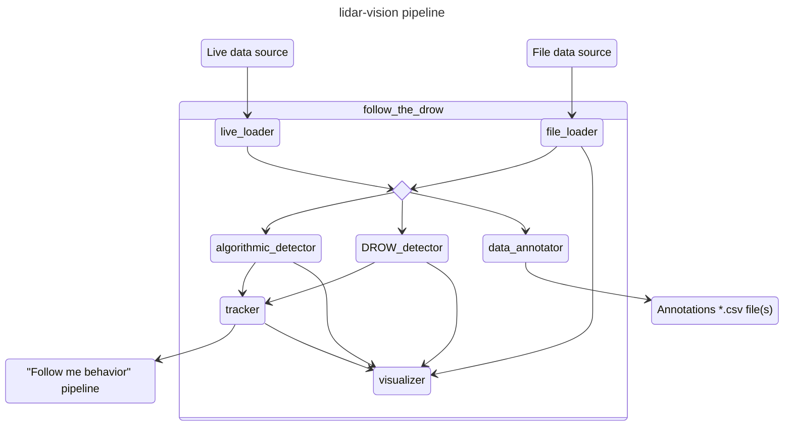

# AGENTS.md

Project index and development reference for coding agents working in this repository. For the client-facing overview see [README.md](README.md); for the research write-up see [docs/RESEARCH.md](docs/RESEARCH.md); for the ROS/Docker deployment stack see [docs/ROS_IMAGE.md](docs/ROS_IMAGE.md).

## Repository map

| Path | What it is |
|---|---|
| `library/follow_the_drow/` | The Python package. Detectors, dataset loaders, preprocessing utilities. |
| `library/follow_the_drow/detectors/` | All eight detector implementations (see registry below). |
| `library/follow_the_drow/datasets/` | `DROW_Dataset`, `FROG_Dataset`, `JRDB_Dataset`, `LiveDataset` (ROS-topic sliding window). |
| `library/follow_the_drow/utils/` | `drow_utils` (preprocessing), `file_utils` (paths/caching), `generic_utils` (`Logging` base class), `plot_utils`, `torch_utils` (device selection). |
| `library/follow_the_drow/include/` | Downloaded datasets + bundled weights (gitignored, populated on `pip install`). |
| `library/cpp_core/` | C++ static library (`AlgorithmicDetector`, `Cluster`, `Point`, `Tracked`, pybind11 `binding`). Namespace: `follow_the_drow`. |
| `deploy/` | ROS Noetic package (`follow_the_drow`), Docker image, launch/RVIZ configs, `conf.env`. |
| `deploy/follow_the_drow/nodes/` | The seven ROS nodes (see ROS section below). |
| `deploy/docker/` | `Dockerfile` (targets: `basic`, `lidar-vision`), `docker-compose.yml`, `entrypoint.sh`. |
| `utils/` | Research scripts: `train.py`, `train_all.py`, `evaluate.py`, `render_video.py`, `training_notebook.ipynb`. |
| `compare/` | Two older comparison notebooks (`algorithmic_detector.ipynb`, `redrow_detector.ipynb`); predate the unified `train.py`/`evaluate.py` CLI and duplicate some of what it now does. Kept for now — see "Known gaps" below. |
| `checkpoints/` | Local training output (gitignored — never commit checkpoints here). |
| `docs/` | Formal research (`RESEARCH.md`) and deployment (`ROS_IMAGE.md`) documentation. |
| `.github/workflows/build-lidar-vision-image.yml` | CI: builds/pushes the ROS Docker image, builds the Python lib, builds the C++ lib. |

## Detector registry

Keys are the canonical `--detector` CLI value and `DETECTOR_REGISTRY` key (`library/follow_the_drow/detectors/__init__.py`). For which of these are faithful ports of a published architecture (with official weights), which are best-effort reimplementations, and which are this project's own novel designs — see docs/RESEARCH.md §2.1. §2.2 there also lists the classical baselines (ROS `leg_detector`, Arras et al., Leigh et al., PeTra) that the DROW/Li2Former/FROG papers compare against but this repo does not replicate, and why.

| Key | Class | File | Architecture | Weights |
|---|---|---|---|---|
| `algorithmic` | `AlgorithmicDetector` | `algorithmic_detector.py` (wraps C++ `cpp_binding`) | Rule-based leg+chest clustering + tracking, attributed in-code to O. Aycard (`cpp_core/sources/detector.cpp`) — **not** a port of the ROS `leg_detector` package or any classical baseline used by the SOTA papers this repo compares against | none (eval only, not trainable) |
| `drow` | `DrowDetector` | `drow_detector.py` | CNN cutout, fixed temporal sum (ICRA 2016 / IROS 2018) | bundled |
| `drspaam` | `DrSpaamDetector` | `architectures.py` | CNN cutout + auto-regressive spatial attention (RA-L 2022) | bundled |
| `spacetime_cnn` | `SpaceTimeCNNDetector` | `full_scan.py` | 2D space-time CNN, full scan, raw unaligned-by-default range input | train locally |
| `fullscan_tcn` | `FullScanTCNDetector` | `full_scan.py` | Causal TCN (per beam) + dilated CNN, full scan | train locally |
| `temporal_unet` | `TemporalUNetDetector` | `full_scan.py` | 1D U-Net with T input channels, full scan (default head: heatmap) | train locally |
| `li2former` | `Li2FormerDetector` | `li2former.py` | CNN backbone + temporal Transformer (Yang et al., TIM 2024) | train locally (no published weights) |
| `lfe_peaks` | `LFEPeaksDetector` | `lfe_detector.py` | 1-D U-Net FCN + peak detection, ONNX (Amodeo et al. 2025) | bundled |
| `lfe_ppn` | `LFEPPNDetector` | `lfe_detector.py` | 1-D U-Net FCN + region proposals, ONNX (Amodeo et al. 2025) | bundled |

Architecture rationale and design decisions for every detector: [docs/RESEARCH.md](docs/RESEARCH.md). Removed architectures (`FullScanCNNDetector`, `FullScanTransformerDetector` — both used recursive/attention components and were deleted from the codebase) are documented there too, Section 6, for provenance only — do not resurrect references to them.

## Datasets

| Class | Format | Beams | Annotations |
|---|---|---|---|
| `DROW_Dataset` | `.csv` + `.odom2` + `.wa`/`.wc`/`.wp` | 450 | Sparse (every 5th frame); 3 classes |
| `FROG_Dataset` | HDF5 | 720 | Dense (every frame); 1 class |
| `JRDB_Dataset` | DROW-compatible | 541 | Dense (every frame); 1 class. **Manual download required** — free registration at jrdb.erc.monash.edu, then extract into `library/follow_the_drow/include/JRDB-data/`. |
| `LiveDataset` | ROS topics (queue) | variable | — maintains a T-scan sliding window (`collections.deque(maxlen=time_frame)`) for real-time use |

Most detectors operate on temporal windows of `T` consecutive scans (default T=5); LFE detectors are single-scan only. `algorithmic`, `drow`, `drspaam`, `li2former` odometry-align historical scans before extracting cutouts; the full-scan detectors (`spacetime_cnn`, `fullscan_tcn`, `temporal_unet`) apply the same rotation correction by default via `--align-scans` (pass `--no-align-scans` for the unaligned ablation) — see docs/RESEARCH.md §4.3.

DROW sequence files: `.bag.csv` (index, timestamp, scan columns), `.bag.odom2` (index, timestamp, x/y/angle odometry), `.bag.wa`/`.bag.wc`/`.bag.wp` (index, walker/wheelchair/person detection arrays).

## Development commands

### Python library

```bash
pip install ./library                    # installs, downloads ~2 GB of bundled datasets/weights
pip install -r utils/requirements.txt    # research script dependencies
```

GPU is auto-selected in order CUDA/ROCm → DirectML (`pip install torch-directml`) → CPU. All trainable detectors are CNN/TCN-only (no RNN, no attention), so all are DirectML-compatible — no `force_cpu` workaround needed anywhere in this repo.

### C++ library

```bash
make build-lib     # cmake + make in library/cpp_core/build; installs only if run as root
```

### Training / evaluation (`utils/`)

```bash
# Train one detector
python train.py --detector spacetime_cnn --dataset frog --epochs 30 --patience 5

# Train all three custom detectors in sequence + summary table
python train_all.py                      # defaults: FROG, 30 epochs, early stopping
python train_all.py --skip li2former
python train_all.py --dataset jrdb

# Evaluate (AUC / precision-recall, dataset verification, CPU benchmark — sections are independent & combinable)
python evaluate.py --dataset drow --drow --drspaam          # published weights, no training
python evaluate.py --dataset frog --lfe-peaks --lfe-ppn     # bundled ONNX weights
python evaluate.py --dataset frog --split test --fullscan-tcn checkpoints/fullscan_tcn.pth --bench
python evaluate.py --dataset drow --verify --no-bench       # dataset stats only, no models

# Render a detection video (MP4 default, native annotation-rate playback)
python render_video.py --dataset frog
python render_video.py --dataset drow --split train --seq 0 --fps 5
python render_video.py --no-algo --drow weights_drow.pth --max-frames 300

# Per-model training notebook (plots loss + AUC per model)
jupyter notebook utils/training_notebook.ipynb
```

`train.py --detector` choices: `algorithmic` (eval only), `spacetime_cnn`, `fullscan_tcn`, `temporal_unet`, `li2former`. `evaluate.py` flags mirror the registry: `--drow [WEIGHTS]`, `--drspaam [WEIGHTS]`, `--spacetime-cnn WEIGHTS`, `--fullscan-tcn WEIGHTS`, `--li2former WEIGHTS`, `--lfe-peaks [WEIGHTS]`, `--lfe-ppn [WEIGHTS]` (omit `WEIGHTS` to use bundled/published weights where available). Run `python train.py --help` / `python evaluate.py --help` / `python render_video.py --help` for the full flag list — it changes more often than this file does.

### Notebooks (`compare/`)

```bash
make redrow-detector-test        # re-runs compare/redrow_detector.ipynb
make algorithmic-detector-test   # re-runs compare/algorithmic_detector.ipynb
```

### ROS / Docker deployment

```bash
make build-image             # build the ROS Docker image locally
make launch-docker-local     # run the full pipeline in Docker, laptop only
make launch-docker-robot     # run against RobAIR (default IP 192.168.1.201; override with ROBAIR_IP=X.X.X.X)
make clean                   # clean-docker + clean-local (removes venv, build artifacts, installed C++ lib)
make help                    # list all Makefile targets with descriptions
```

All ROS runtime configuration goes through `deploy/conf.env` (per-node enable flags, topic names, algorithmic-detector tuning parameters, tracking policy, etc.) — see [docs/ROS_IMAGE.md](docs/ROS_IMAGE.md) and the file itself for the full variable list. Node behaviour details (constructor params, topics consumed/produced) are documented per-node below.

## ROS node reference



| Node | Role |
|---|---|
| `live_loader` | Ingests "scan"/"scan2"/"odom" ROS topics, transforms to polar, aggregates top+bottom lidar into one frame, publishes `raw_data`. Disabled by default. |
| `file_loader` | Replays a DROW-format dataset split (default: test) as `raw_data` + `detection.msg` annotations (every 5th scan). `persons_only` restricts annotations to the `wp` class. |
| `visualizer` | Publishes everything (raw scans, annotations, detections, tracked position) to RVIZ. `flatten` (default true) zeroes the z-coordinate. Separate background/foreground topics for independent enable/disable. |
| `algorithmic_detector` | Runs the C++ `AlgorithmicDetector` (clustering + tracking) on `raw_data`. 13 tunable constructor params (frequency/uncertainty/cluster-size thresholds) — see `deploy/conf.env`. |
| `DROW_detector` | Runs the published DROW neural network. `threshold` (default 0.8) + `persons_only` flag. No GPU on the laptop or RobAIR ⇒ runs at ≈1 Hz. |
| `data_annotator` | RVIZ-driven manual re-annotation tool for DROW-format datasets. Must run exclusive of all other nodes. Controls: "Publish point" = annotate person, "Publish initial position" = next frame, "Publish goal" = clear frame / go back. |
| `tracker` (`PersonTracker`) | Tracks one person from one detector's output. Policies: `first`, `closest`, `tracked` (default), `none`. Output is persistent — always publishes a position, falling back to robot coordinates `(0,0)` when nothing is tracked. |

Debug builds include GDB by default (`deploy/follow_the_drow/CMakeLists.txt` line 5: `RelWithDebInfo`, switch to `Release`/`Debug` as needed); launch with `launch-prefix="gdb -batch -ex run -ex bt --args"` to attach.

## Notes

- **RobAIR FoV**: 725 rays, ~255°. Camera FoV is narrower: rays 315–430.
- **DROW detector frequency**: paper used 12.5 Hz; this system runs at 10 Hz for compatibility.
- **JRDB**: 541 beams, 270° FoV (`linspace(-135°, +135°, 541)`), SICK LMS 500 scanner; manual dataset registration required (see Datasets table above).

## Development conventions

- No enforced linter/formatter is configured (no ruff/black/flake8/pre-commit config in the repo) — match the surrounding file's existing style rather than reformatting wholesale.
- C++17, single namespace `follow_the_drow` for all C++ library code; pybind11 bindings live in `binding.cpp`/`binding.hpp` and are excluded from the standalone C++ distribution (see `cpp_core/CMakeLists.txt`).
- `*.ipynb` files are filtered through `nbstripout` (`.gitattributes`) — notebook outputs should not be committed; if you edit a notebook, clear outputs before committing (git will strip them anyway, but don't rely on that during local review).
- Trainable detectors must stay CNN/TCN-only (no RNN, no attention) per the research constraint in docs/RESEARCH.md §2 — this is a deliberate scope boundary, not an oversight, so don't "fix" it by reintroducing recurrence/attention without checking with the user first.
- Local training artifacts (`checkpoints/`, `runs/`, `utils/*.pth`, `utils/plots/`) are gitignored — never force-add them.
- Dataset/weight caches under `library/follow_the_drow/include/` and `compare/cache/` are gitignored and populated at install/run time — don't commit them, don't assume they exist without running the relevant install/download step first.

## Known gaps (as of the last documentation pass)

- **Evaluation tables incomplete.** docs/RESEARCH.md §8.1/8.2 have `TBD` cells — filling them requires training Li2Former/Architecture A/B/C once each and running the existing `evaluate_auc()`/`evaluate.py --bench` pipeline across all applicable (detector × dataset) pairs. This is a research task requiring GPU time, not a documentation fix — see docs/RESEARCH.md §8.4 for the orchestration plan.
- **`compare/*.ipynb` may be redundant** with `evaluate.py` (which superseded them for most metrics). Not yet resolved — read through before deleting, in case something un-ported still lives only there.
- **Dockerfile note**: `deploy/docker/Dockerfile`'s `basic` target installs GDB + `ros-noetic-desktop-full` + initializes `catkin_ws` at build time — these lines were found commented out and were restored during the initial-publication cleanup; if the image build behaves unexpectedly, check that this hasn't regressed again.

## Future development ideas

1. **Translation odometry** — only rotation is currently corrected for when aligning historical scans; incorporating translation could improve alignment at higher robot speeds.
2. **Bag file recording** — add ROS bag recording to the launch configuration for capturing live sessions for offline replay/evaluation.
3. **Algorithmic detector hyperparameter presets** — store/auto-load tuned parameter sets for 1-lidar and 2-lidar configurations, analogous to bundled neural-detector weights.
4. **Systematic DROW re-annotation** — the annotation-quality analysis (docs/RESEARCH.md §3.1) found large label gaps; algorithmic or semi-automatic re-annotation could produce a denser ground truth and a fairer DROW-benchmark comparison.
5. **Multi-target tracking** — `PersonTracker` currently follows one selected person; extending it to an ID-consistent multi-person track set would enable richer follow-me/crowd-monitoring scenarios.
