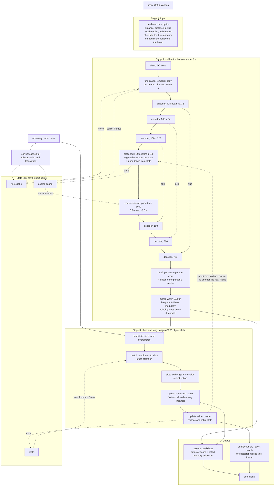

# Proposed architecture: a streaming person detector built on three temporal horizons

**Status:** design settled for review, 2026-09-14. Nothing described here is built or trained yet.
**Readers:** the project owner, collaborating researchers, and anyone new to 2D LiDAR person detection.
**Companion documents:** [`PAPER.md`](PAPER.md) holds the measurements this design rests on; [`../TODO.md`](../TODO.md) item A43 holds the work plan.

**How to read this.** §1 is the whole proposal on one page. §3 is the idea everything else follows from. §5.2 lists every building block with where it comes from. Numbers are measured in this repository unless marked *published*.

---

## 1. The proposal on one page

**The sensor.** A 2D LiDAR mounted at knee height spins a laser in a horizontal plane and returns one distance per direction: 720 distances per revolution, 26 revolutions per second on the FROG dataset. A person appears as two short arcs — their legs.

**The problem.** A chair or table also shows up as a few short arcs. Published detectors that look at one scan at a time report **1.4 to 3.4 non-existent people per frame**, and at the same rate whether anyone is in the room or not. The standard benchmark hides this, because it scores only frames that contain people and reports a ratio.

**What time can tell apart.** Watching over time helps, but different spans of time tell you different things:

- over **less than a second** (*calibration*), repeated scans of the same surface give a cleaner, steadier shape;
- over **one to a few seconds** (*short*), a person stays the same person even when a scan misses them;
- over **tens of seconds** (*long*), people eventually move, and furniture never does.

**What we tried first, and why it failed.** Adding memory *after* an existing detector — a standard tracker, maps of where things have been, and idealised filters with perfect hindsight — never removed false detections as cheaply as simply tuning the detector's own merging distance. The two reasons: matching detections across frames with a fixed distance breaks down in crowds, and remembering *places* is meaningless on a robot that drives past everything.

**What we propose.** One network that processes the scan stream frame by frame, `step(scan, odometry, state) -> (detections, state)`, with one memory for each horizon built inside it:

| stage | horizon | in one sentence |
| --- | --- | --- |
| **1. input** | — | converts each distance into a small, pose-independent description of the local shape around it |
| **2. calibration memory** | under 1 s | a whole-scan convolutional network that reads the last ~1.3 s of its own features from a cache |
| **3. short and long memory** | seconds to tens of seconds | a set of 256 "slots", one per tracked object, each with a learned state that decays quickly or slowly |

The object memory feeds back into stage 2 *before* anything is thresholded, so memory can make a faint person visible rather than only deleting detections afterwards.

**The cost.** About 300 million multiply-adds per frame and 22 MB of training memory per frame at a first sizing — around 12 times the lightest published detector, and 60 to 290 times *less* than the published detectors that already use time (§7).

## 2. Background

### 2.1 Datasets

| dataset | what it is | used here for |
| --- | --- | --- |
| **FROG** — Amodeo, Pérez-Higueras, Merino & Caballero, *Frontiers in Robotics and AI* 2025 | six ~30-minute recordings from a robot in a museum; 720 beams per scan at 26.2 Hz; every scan annotated with person positions; no person identities across frames | all measurements and training |
| **DROW** — Beyer, Hermans & Leibe, 2016 and 2018 | recordings in a care facility; 450 beams at ~10 Hz; people, wheelchairs and walkers annotated on every 5th scan | cross-venue checks |

This project reorganised FROG into three partitions: `official` reproduces the published benchmark; `balanced` mixes crowded, sparse and empty scenes in train, validation and test; `transferred` evaluates on 72,533 person-free frames that the benchmark never scores.

### 2.2 Current detectors

| detector | how it works | uses time? | published FROG AP | in this repository |
| --- | --- | --- | --- | --- |
| **DROW** — Beyer, Hermans & Leibe (2016, 2018) | cuts a fixed-width window around every beam, normalises its depth, and classifies each window with a small CNN; adds up a few past frames | yes, a fixed sum | 73.9% (DROW3) | `DrowDetector`, official weights |
| **DR-SPAAM** — Jia, Hermans & Leibe, *IROS* 2020 | DROW's windows, plus attention to neighbouring beams and an auto-regressive template carried from frame to frame | yes, a running template | 75.6% | `DrSpaamDetector`, official weights; runs a 5-frame window per call, unlike the official streaming code |
| **Li2Former** — Yang et al., *IEEE Trans. Instrum. Meas.* 2024 | DROW-style windows, with a Transformer attending across the last frames of each beam | yes, per-beam attention | not published | `Li2FormerDetector`, a reimplementation; never trained to completion here because it ran out of memory |
| **LFE-Peaks, LFE-PPN** — Amodeo et al., 2025 (the FROG paper) | the whole scan as one 1D signal through a U-Net; either picks peaks of a per-beam probability or decodes range anchors | no | 65.6%, 69.2% | `LFEPeaksDetector`, `LFEPPNDetector`, the authors' ONNX files |

*AP is average precision at a 0.5 m matching distance.*

### 2.3 What these detectors get wrong

Measured on the LFE detectors with the authors' own weights and operating threshold:

| | AP, frames with people | false detections per frame, frames with people | false detections per frame, empty frames | false detections still there one frame later |
| --- | --- | --- | --- | --- |
| LFE-Peaks | 65.1% | 1.76 | 1.39 | 88.3% |
| LFE-PPN | 69.6% | 5.03 | 3.17 | 77.6% |

The false detections do not flicker: they sit on furniture and come back every frame. Over a second or two, a person standing still and a chair look identical. That is why short temporal windows help so little, and why the useful evidence must come from longer horizons.

### 2.4 First attempt: memory added after the detector

Every mechanism is scored by its **exchange rate**: how many false detections it removes for each real person it loses. Higher is better; no mechanism below had an optimal setting, only this trade.

| mechanism | works in real time? | exchange rate, LFE-Peaks | LFE-PPN |
| --- | --- | --- | --- |
| map counting detections per location | yes | 0.57 | — |
| map of persistent scan returns per location | yes | 1.90 | 3.32 |
| drop short-lived trails | no — idealised, sees the future | 2.54 | — |
| SORT tracker (Bewley et al., *ICIP* 2016) | yes | 3.8 | 9.8 |
| drop trails that never move | no — idealised, sees the future | 4.20 | — |
| **widen the detector's merging distance from 0.30 to 0.40 m** | yes | **21.9** | **~63** |

Two reasons, and neither is about how long memory lasts:

- **Matching by distance fails in crowds.** One fixed distance cannot be small enough to tell apart ~4 people per frame and large enough to follow one person walking. Even the idealised filters are limited by this.
- **Remembering places fails on a moving robot.** How long something has been at a spot mostly measures how long the robot looked at that spot. Only 11.3% of false detections were watched for 30 s, and none for 100 s.

### 2.5 Where the remaining gains are

| gain | size | how it was measured |
| --- | --- | --- |
| people missed in one frame but detected shortly before or after | +9.6 percentage points of recall (LFE-Peaks), +6.7 (LFE-PPN); 90% of it within 10 s | replaying annotations with perfect matching |
| people missed just below the detection threshold | 4.4 points of recall | the detector's own per-beam probabilities |
| people the detector is blind to, mostly small and far (median 10 beams, 6-8 m) | 14.1 points of recall | same — a problem of input representation, not of memory |
| a short temporal window | +1.9 points of AP | *published*, DR-SPAAM with 5 frames against 1 |

### 2.6 How to describe the input

A nearest-neighbour classifier with no learned model compares ways of describing the neighbourhood of a beam (lower error means the description separates people from background better):

| description of a beam's neighbourhood | error |
| --- | --- |
| DROW's window, width adapted to distance, depth centred on the beam | 11.08% |
| same adaptive window, as **2D offsets relative to the beam** | 12.38% |
| fixed window, as 2D offsets relative to the beam | 13.39% |
| fixed window, DROW's depth centring | 13.56% |
| fixed window, LFE's global normalisation `1 - r/10` | 19.60% |

Offsets relative to each beam work as well as DROW's hand-built windows and much better than LFE's normalisation, without DROW's machinery. Distance still adds about one point.

## 3. The base of the design: three temporal horizons

The architecture follows from one observation: **the evidence that separates a person from furniture exists at three different time horizons, each supplying something the others cannot, and each needing a different kind of memory.**

| horizon | span | what it supplies | evidence | memory in the network | addressed by |
| --- | --- | --- | --- | --- | --- |
| **calibration** | under 1 s | a clean, steady local shape: repeated scans of one surface average out noise | a short window adds +1.9 points of AP (*published*); shuffling the order of a 5-frame window costs only 0.5 points, so this horizon averages rather than sees motion; an information probe peaks at a 1.0-1.8 s span | stage 2 — a fine temporal convolution (~0.08 s) and a coarse one (~1.3 s) | beam, then angular sector |
| **short** | 1 to a few seconds | continuity: a person stays the same person through missed scans, occlusion and walking | +9.6 points of recall recoverable, 90% of it within 10 s; the median person stays in view 4.9 s | stage 3 — fast-decaying channels of the object slots | object |
| **long** | tens of seconds | permanence: people eventually move, furniture never does | movement over a trail's life is the only feature that beat a tracker (§2.4); false-detection trails last up to 44 s | stage 3 — slow-decaying channels of the same slots | object |

**Why the addressing changes.** Within the calibration horizon the robot moves at most about half a metre, so memory can still be addressed by beam or angular sector, provided it is re-aligned for the robot's motion. Beyond that, a beam points somewhere else entirely, and a place is only watched while the robot passes it (§2.4). So the short and long memories are addressed by *object*.

**Why short and long share one memory.** Replaying the data shows one continuous horizon rather than two separate timescales. Both live in the same slot state and differ only in how fast each channel decays.

**Priority.** Calibration first: proven and published, it is the floor. Short second: it holds the largest measured gain. Long third: every mechanism that tried to reach it from outside the network failed (§2.4), but that limits those mechanisms, not the horizon, so its structure stays in the model.

## 4. Design principles

| # | principle | reason |
| --- | --- | --- |
| 1 | constant work per frame, however long the robot has been running | real time on a robot; current detectors take 1.5 to 14 ms per frame |
| 2 | long memory is carried as state, not as a window of past scans | 10 s is 262 frames and 30 s is 786 |
| 3 | nothing is remembered per beam for more than a second or two | over 30 s the robot moves ~15 m; a beam's memory would describe somewhere else |
| 4 | long memory is kept per object, not per place | §2.4 |
| 5 | matching across frames is learned, not a fixed distance | §2.4 |
| 6 | memory adds evidence but never deletes a detection on its own; the single-frame path stays intact | people standing still are already missed 1.6-2x more often than walking people |
| 7 | every cache is corrected for the robot's rotation **and** translation | the robot moves ~0.5 m and turns up to ~10° per second |
| 8 | every comparison uses models trained on the same data | otherwise a gain from seeing empty rooms is credited to memory |
| 9 | settings are in physical units — seconds, metres, degrees | the same trained model should run on other sensors and frame rates |

## 5. Architecture

### 5.1 Overview

The model is called once per scan and keeps its memory between calls:

```text
detections_t, state_t = model.step(scan_t, odometry_t, state_{t-1})
model.reset()                                  # between recordings
```

| part of the state | contents | size |
| --- | --- | --- |
| fine cache | the last 2 frames of full-resolution features, with each beam's endpoint in room coordinates | 2 x 720 x 32 |
| coarse cache | the last 32 frames of low-resolution features, with the robot's pose for each | 32 x 90 x 128 |
| slots | 256 x [in use, value, position, velocity, learned state, statistics] | 256 x ~140 |

In total, about 1.8 MB is carried from one frame to the next.



| memory | where | span | addressed by | horizon (§3) |
| --- | --- | --- | --- | --- |
| ~~fine temporal convolution~~ (**removed 2026-09-17**: tested, not needed; `TODO.md` A50) | stage 2, full resolution | ~0.08 s | beam | calibration |
| coarse space-time convolution | stage 2, bottleneck | ~1.3 s | angular sector | calibration, reaching into short |
| slot state, fast channels | stage 3 | ~1-10 s | object | short |
| slot state, slow channels | stage 3 | ~10-60 s | object | long |

### 5.2 Building blocks

Nothing between the blocks is exotic; the combination is what is new for this task.

| block | what it does here | taken from | why this choice |
| --- | --- | --- | --- |
| beam-relative 2D offsets as input | describes each beam's neighbourhood independently of where the robot is | DROW's depth centring (Beyer et al.), extended from one axis to two | matches DROW's preprocessing, beats LFE's by ~6 points (§2.6), and keeps cached features valid while the robot moves |
| causal dilated temporal convolution | combines the current frame with chosen past frames | temporal convolutional networks — WaveNet (van den Oord et al., 2016); TCN (Bai, Kolter & Koltun, 2018) | fixed cost per frame, trains in parallel, and one layer can reach far back with few taps |
| streaming with per-layer caches | runs a clip-trained convolution one frame at a time without recomputing the past | Rybakov et al., *Interspeech* 2020; Continual Inference Networks (Hedegaard & Iosifidis, *ECCV* 2022) and its [`continual-inference`](https://github.com/lukashedegaard/continual-inference) library | exact, and a drop-in PyTorch implementation exists |
| 1D U-Net | dense per-beam prediction with whole-scan context | U-Net (Ronneberger, Fischer & Brox, *MICCAI* 2015); LFE (Amodeo et al., 2025) for this sensor | the shape that already reaches 65-70% AP on FROG at ~1.5 ms |
| ConvNeXt-style blocks | depthwise large kernel, widened then narrowed, residual | ConvNeXt (Liu et al., *CVPR* 2022); MedNeXt (Roy et al., *MICCAI* 2023) | a modernised convolution block; nnU-Net Revisited (Isensee et al., *MICCAI* 2024) found well-configured CNN U-Nets still beat Transformer and Mamba segmenters |
| global max aggregator | lets every part of the scan see a summary of the whole scan | LFE (Amodeo et al., 2025) | cheap, and part of the best-performing published full-scan design |
| cache correction with pose channels | keeps cached low-resolution features aligned while the robot moves | TimePillars (arXiv 2312.17260, 2023) | the robot turns up to 10° per second; uncorrected memory smears |
| per-beam score + offset head | predicts a person score and the offset to the person's centre for every beam | DROW's vote head | positions come out directly and feed stage 3 |
| object slots with learned matching | one memory entry per tracked object, matched to candidates by attention | MOTR (Zeng et al., *ECCV* 2022); TrackFormer (Meinhardt et al., *CVPR* 2022) | replaces the fixed matching distance that failed (§2.4) |
| one state-space model per track, with slots exchanging information | per-object recurrent state updated one step per frame; slots coordinate in crowds | SambaMOTR (Segu et al., *ICLR* 2025) | the closest published match to stage 3 |
| selective diagonal recurrence | state that holds when nothing is observed and updates fast when it is | Mamba (Gu & Dao, 2023); S5 (Smith, Warrington & Linderman, *ICLR* 2023) | one layer spans seconds to a minute; using the real time step makes it independent of frame rate |
| prior drawn from memory into the detector | feeds predicted object positions back as detector input | CenterTrack (Zhou, Koltun & Krähenbühl, *ECCV* 2020) | lets memory make a faint person visible before thresholding; trainable from single frames |
| value-ranked slot replacement | decides which slot a new candidate may take when memory is full | ours; checked by replaying real data (§5.5) | protects people who are briefly hidden |

### 5.3 Stage 1 — input

Scans are first resampled to one fixed angular spacing, so a convolution kernel covers the same angle on any sensor. Each beam then gets 11 numbers:

| numbers | count | meaning |
| --- | --- | --- |
| distance | 1 | how far away; objects look smaller when far |
| distance minus the median distance of nearby beams | 1 | whether this return sticks out in front of its surroundings — DROW's depth centring as a filter |
| valid return | 1 | missing and maximum-range returns are not surfaces |
| offsets to the 2 neighbouring beams on each side, measured along and across this beam | 8 | the local shape; a leg gives the same numbers at any bearing and distance |

The last group is also what makes caching work: numbers measured relative to each beam do not change when the robot moves, so cached features stay valid and only need to be moved to their new beam index.

### 5.4 Stage 2 — the calibration horizon

**Two temporal scales.** Consecutive frames calibrate, because almost nothing moves between them; a ~1.3 s span begins to show a walking person's motion. Both are one dilated causal convolution, split across two resolutions:

| layer | resolution | frames read | past offsets | why at this resolution |
| --- | --- | --- | --- | --- |
| fine | full, each beam separately | 3, consecutive | 0, 0.04, 0.08 s | pure calibration |
| coarse | 90 angular sectors, with neighbouring sectors | 5, eight frames apart | 0, 0.31, 0.61, 0.92, 1.22 s | a walking person crosses many beams in a second but only a few sectors |

Each call computes one new frame per layer and reads the rest from its cache, so every frame is used at no extra cost.

**Backbone.** A 1D U-Net (§5.2) with widths 32, 64 and 128 at 720, 360 and 180 beams, a 90-sector bottleneck, and LFE's global max aggregator at the bottleneck.

**Keeping caches aligned.**

| cache | correction on every frame |
| --- | --- |
| fine | move each cached beam's endpoint into the current sensor frame and write its features to the beam it now falls on, nearest distance winning — an index operation |
| coarse | shift sectors to undo rotation, and give the network the relative pose of each past frame as extra input, as TimePillars does |

During training the same layers run on short clips without caches; streaming reproduces the clip exactly, up to the alignment correction.

**Output of stage 2.** For each beam, a person score and an offset to the person's centre. Candidates closer than 0.30 m are merged, and the 64 best are passed on with their features — including those below the reporting threshold, which is how memory can lift a borderline person.

### 5.5 Stage 3 — the short and long horizons

**Slots.** 256 slots, stored in room coordinates. When the robot moves, slots stay put and new candidates are converted into room coordinates instead, so a chair keeps zero velocity and zero movement — exactly the feature that separated furniture from people in §2.4. Each slot holds a position, a velocity, a learned state, a *value*, and four statistics: age, time since last matched, how far it has moved, and how often it is matched.

**Each frame:**

1. **Predict** where each slot should be, from its velocity and the real time since the last frame.
2. **Match** candidates to slots with cross-attention, biased towards nearby candidates. It is learned and needs no person identities, which FROG does not have.
3. **Exchange** information between slots with self-attention, because crowds are where matching failed.
4. **Update** each slot's state: `h <- λ(u) * h + B(u) u`, where the decay `λ(u) = exp(-Δt · softplus(W u))` depends on the new observation `u`. An unobserved slot keeps its state; a matched one updates quickly. Decay times start spread between 1 and 60 s, giving fast (short-horizon) and slow (long-horizon) channels.
5. **Manage slots** by their value, as below.
6. **Report** detections, as below.

**Slot value: creating, replacing and retiring slots.** Each slot carries one number, its *value* — how certain it is that something is there. Until stage 3 is trained this follows fixed rules; afterwards it is a learned score.

| event | rule |
| --- | --- |
| matched to a candidate with score `s` | value rises: `v <- v + gain · (1 - v) · s` |
| unmatched for Δt seconds | value fades: `v <- v · exp(-Δt / τ)`, set so that full certainty fades out in `fade_time_s` |
| value below `spawn_floor` | slot is freed |
| unmatched candidate with score of at least `spawn_floor` | takes a free slot, strongest candidate first |
| no free slot | the strongest remaining candidate replaces the weakest slot, but only if `s > v + eviction_margin`; a slot matched or created this frame is never replaced |

- **Why accumulated value, not the latest score.** A person hidden behind someone else scores zero this frame. Ranked by latest score, the first false detection would take their slot. Ranked by value, someone tracked for eight seconds keeps their slot for seconds while hidden.
- **Why any candidate may create a slot.** A slot that never matches again simply fades, so confirmation would only add delay, and weak evidence kept in spare slots is what later lifts a borderline person.
- **Why a margin.** Without it, similar background candidates would replace each other every frame.

Replayed on every frame of the FROG test recording, with candidates down to a score of 0.01, and compared with unlimited memory and with an idealised rule that never replaces a slot holding an annotated person:

| detector | memory | slots in use: mean / 99th percentile / max | slots holding an annotated person that were replaced | missed people with a slot within 0.5 m |
| --- | --- | --- | --- | --- |
| LFE-Peaks | 256 slots | 21.6 / 73 / 91 | 0 | 71.6% |
| LFE-PPN | 256 slots, margin 0 | 79.1 / 179 / 256 | 2 in 50,088 frames | 90.6% |
| LFE-PPN | 256 slots, margin 0.1 or 0.2 | same | 1 | same |
| LFE-PPN | idealised rule, or unlimited slots | same (unlimited max: 290) | 0 | same |

256 slots are enough and the rule performs as well as the idealised one. The last column is an upper bound, not recall: it counts any slot near a missed person, whether it came from memory or from that frame's weak candidate.

**Output and feedback.**

- **Rescoring.** Each candidate's score is the detector's score plus memory evidence through a gate that starts at zero, so the untrained model behaves exactly like stage 2 alone.
- **Reporting missed people.** A slot with no matching candidate but a high value reports a detection — the "detected shortly before or after" gain of §2.5.
- **Feedback.** Slot positions predicted for the next frame are drawn into extra input channels at stage 2's bottleneck. Memory therefore changes what the detector sees, before any threshold — the difference between this design and a detector followed by a tracker.

## 6. Configuration

"Needs retraining" marks settings that change the network's shape; all others can change on a trained model, because they are in physical units or act on the unordered set of slots.

### 6.1 Input settings

| setting | meaning | default | reasoning | needs retraining |
| --- | --- | --- | --- | --- |
| `angular_resolution_deg` | fixed angular spacing every scan is resampled to | the training sensor's (FROG) | the same kernel then covers the same angle on every sensor; exact value to confirm (§15) | no |
| `panoramic` | whether the scan covers a full circle and wraps around | per sensor | a partial field of view must not wrap | no |
| `max_range_m` | distances beyond this are clipped | 10.0 | no annotated person in the FROG test recording is further away | no |
| `median_window_deg` | width of the neighbourhood for the median-distance channel | ~11 | the angular width of a person at 4 m, the median distance to a person; to tune | no |
| `local_offset_neighbours` | neighbours on each side in the offset channels | 2 | smallest window that shows a leg's curvature | yes |

### 6.2 Stage 2 settings

| setting | meaning | default | reasoning | needs retraining |
| --- | --- | --- | --- | --- |
| ~~`fine_lags_s`~~ | removed with the fine temporal convolution (2026-09-17) | - | - | - |
| `max_range_m` | the model's range: missing, non-positive and farther readings all read as this value | `10.0` | FROG is annotated to 10 m; one rule for every dataset's no-return encoding (`memory/noise-structure.md`) | yes |
| `coarse_lags_s` | past offsets read by the coarse convolution | `[0, 0.31, 0.61, 0.92, 1.22]` | ~1.3 s; an information probe peaks at 1.0-1.8 s | no |
| `channels` | encoder widths | `[32, 64, 128]` | first sizing, comparable to LFE | yes |
| `blocks_per_level` | ConvNeXt blocks per encoder level (decoder: 1) | `[2, 2, 2]`, bottleneck 2 | first sizing | yes |
| `kernel_size` | depthwise convolution kernel | 7 | ConvNeXt's default | yes |
| `expansion` | block widening factor | 4 | ConvNeXt's default; 2 roughly halves parameters (§12) | yes |
| `global_aggregator` | add a global max over the scan at the bottleneck | on | LFE's design | yes |
| `merge_radius_m` | candidates closer than this are merged | 0.30 | reproduces LFE's published accuracy | no |
| `num_proposals` | candidates passed to stage 3 | 64 | ~4-8 real detections per frame, with room for faint ones | no |
| `prior_injection` | where memory's prior enters stage 2 | `bottleneck` | cheapest; predicted positions are coarse anyway | yes |

### 6.3 Stage 3 settings

| setting | meaning | default | reasoning | needs retraining |
| --- | --- | --- | --- | --- |
| `num_slots` | slot capacity | 256 | replay: the densest detector reaches 256 with no measurable loss (§5.5) | no |
| `slot_dim` | size of each slot's state | 128 | matches the bottleneck width | yes |
| `attention_heads` | heads in matching and slot exchange | 4 | first sizing | yes |
| `decay_init_s` | range the decay times start from | `[1, 60]` | spans the short and long horizons (§3) | starting point only |
| `association_sigma_m` | how strongly matching prefers nearby candidates | 0.6 | the matching distance used in all measurements here | no |
| `spawn_floor` | minimum score to create a slot; also the level at which a slot is freed | 0.01 | with value-ranked replacement, weak evidence only uses spare slots | no |
| `value_gain` | how fast a matched slot's value rises | 0.1 | ~20 confident matches, under one second, reach high certainty | no |
| `eviction_margin` | how much more certain a candidate must be to replace a slot | 0.1 | no measurable effect at 256 slots; prevents churn | no |
| `fade_time_s` | time for full certainty to fade out | 10 | 90% of the "detected before or after" gain lies within 10 s | no |
| `coast_value_threshold` | value above which a slot reports an unseen person | to tune | trades recovered people against lingering false detections | no |

### 6.4 Training settings

| setting | meaning | default | reasoning |
| --- | --- | --- | --- |
| `clip_frames` | clip length for training stage 2 | 35 | the coarse convolution's reach, ~1.34 s |
| `chunk_s` | chunk lengths when training memory, in increasing order | `[1, 10, 30]` | the short horizon first, then the long |
| `state_reset_prob` | chance that a chunk starts from empty memory within a recording | 0.2 | a deployed robot's memory is always warm; training must see both |
| `match_radius_m` | distance for matching detections to annotations in the loss | 0.5 | the benchmark's matching distance |
| `prior_jitter_m`, `prior_drop_prob`, `prior_false_rate` | how simulated priors are corrupted in training | to tune | stops the network from copying its prior |

## 7. Efficiency

### 7.1 How cost grows

With N beams, C channels, k kernel size, L layers, K slots, P candidates, D slot size and S state size, per frame:

| part | cost |
| --- | --- |
| input description | O(N) |
| cache correction | O(N) fine, O(N/8 · 32) coarse |
| stage 2 network | O(N · C² · L) + O(N · C · k · L) — independent of how far back memory reaches |
| candidate selection | O(N log P) |
| stage 3 | O(K · P · D) matching + O(K² · D) slot exchange + O(K · D · S) update |

Memory is O(2 · N · C + 32 · N/8 · C + K · (D + S)). Nothing grows with recording length.

### 7.2 Counted against the current detectors

Multiply-adds are a hardware-independent count of the arithmetic a network performs. They were counted per frame at 720 beams and batch size 1: with PyTorch's operation counter for the PyTorch models (which reports twice the multiply-adds, halved here after checking on single layers), and by running the ONNX graph layer by layer for LFE. Training memory is what PyTorch actually stores for the backward pass.

| model | multiply-adds per frame | parameters | training memory per frame | memory kept between frames |
| --- | --- | --- | --- | --- |
| LFE-Peaks | 24 M | 53 K | — | none |
| LFE-PPN | 26 M | 171 K | — | none |
| **this proposal, first sizing** | **303 M** (stage 3: 106 M) | 1.49 M | **22 MB** | ~1.8 MB |
| DR-SPAAM, official streaming code | 18.4 G | 1.98 M | — | ~10 MB |
| DR-SPAAM, 5-frame window (this repository's version) | 48.0 G | 1.98 M | 1.4 GB | none |
| DR-SPAAM, 10-frame window (official setting) | 88.2 G | 1.98 M | 2.6 GB | none |
| Li2Former, 5 frames | 88.2 G | 4.70 M | 2.0 GB | none |

*This proposal counted from a sketch with the defaults of §6. DR-SPAAM counted at 720 beams directly, because its attention compares all 720 beams with each other; Li2Former extrapolated from 72 beams after checking the count doubles from 36 to 72.*

### 7.3 What the numbers mean

- **The cost of current temporal detectors comes from how many positions they process, not from attention.** DR-SPAAM runs a 128-512-channel CNN over a 56-point window around each of 720 beams (~40,000 positions per scan); Li2Former a 512-channel CNN over 720 windows of 64 points for 5 frames (~230,000). Their attention is cheap by comparison: Li2Former attends over only 5 frames per beam, and DR-SPAAM's 720 x 720 beam comparison is ~7 G of its 48 G. A whole-scan network processes 720 positions with narrow channels.
- **This proposal's own quadratic part** — 256 slots exchanging information — is roughly 34 M of its 303 M.
- **Training memory.** Li2Former's 2 GB per frame explains why it ran out of memory here at batch size 2. This proposal stores ~22 MB per frame: a 35-frame clip needs ~0.8 GB, but a 10-second chunk trained end to end ~5.7 GB, so full-model training needs short gradient windows or activation checkpointing.
- **Limits of the count.** Multiply-adds are not milliseconds: attention and memory lookups run slower than their count suggests, so the model must be timed once built. The first sizing's 1.49 M parameters are above this project's usual 100-500 K range, mostly because of the 4x block widening (§12).

## 8. Training

| phase | what is trained | on | memory prior fed to stage 2 |
| --- | --- | --- | --- |
| **A** | stages 1-2 | 35-frame clips | simulated from annotations, deliberately corrupted |
| **B** | stage 3 | long sequences of candidates saved from the frozen stages 1-2 | simulated |
| **C** | everything | consecutive chunks of whole recordings | the model's own |

- **Simulated priors** let stage 2 learn to use feedback without first training the memory — the approach CenterTrack uses. They are jittered, drop people and add false tracks so the network cannot copy them.
- **Memory across chunks** is carried between consecutive chunks of the same recording, with gradients cut between chunks. It is reset at the start of every recording and at 20% of chunk starts, so training sees both the warm memory of a running robot and a fresh start.
- **Loss.** Final detections are matched one-to-one to annotations within 0.5 m (Hungarian matching); a focal loss on scores, an L1 loss on positions, and a loss on slot values.
- **Data.** FROG `official` first, for comparability with published numbers, then `balanced`, which includes empty scenes.
- **Baseline.** The same model with memory reset every frame, no prior and no temporal layers, trained on the same data.

## 9. Evaluation

- **Frames with people** (FROG test recording): AP at 0.5 m and 0.3 m matching, recall at a fixed threshold, false detections and missed people per frame, milliseconds per frame.
- **Empty frames** (72,533 person-free frames): false detections per frame and share of frames with any. AP cannot be computed there.
- **Exchange rate**, against SORT (3.8 / 9.8) and the merging-distance tweak (21.9 / ~63).
- **Against the ideal**: how much of the +9.6-point "detected before or after" gain is recovered.
- **Always reported separately**: people standing still, and missed people next to every false-detection figure.

**Ablations** — each removes or replaces one piece:

| change | what it tests |
| --- | --- |
| remove the fine temporal convolution | the calibration horizon (**done**: a tie at three seeds, removed 2026-09-17) |
| remove the coarse temporal convolution | the ~1.3 s motion scale |
| remove stage 3 | the short and long horizons together |
| replace stage 3 with SORT on the same candidates | learned matching and state against a classical tracker |
| remove the feedback prior | whether memory must change what the detector sees |
| cap all decay times at 1 s | the long horizon |
| use sensor-frame x, y instead of beam-relative offsets | the input description and cache validity |
| 64 / 128 / 256 slots | slot capacity |

## 10. Build plan

| step | what | continue if |
| --- | --- | --- |
| **0** | the `step` / `reset` interface and caches, tests written first: streaming equals the clip computation; `reset` clears everything; a static scene stays unchanged under pure robot motion; slot replacement never takes a slot matched this frame | tests pass |
| **1** | stage 3 alone, on saved candidates from LFE-Peaks — positions and scores only, no feedback | it beats SORT on the same candidates, and the merging-distance tweak at equal recall |
| **2** | stages 1-2, training phase A | the single-frame path reaches LFE's published AP, and shuffling frame order hurts |
| **3** | stage 3 on the new stage 2 (phase B), then everything with feedback (phase C) | it beats steps 1 and 2 |
| **4** | ablations (§9) on `official`, then `balanced` | — |

Step 1 gives stage 3 the weakest input it will ever see, so a gain there is a floor and a null result is not yet a verdict.

## 11. Risks

- **The long horizon cannot judge a person who has not moved yet.** The best movement-based filter needed to see the future; in real time, a person who has stood still for twenty seconds and a chair look alike. Feedback sharpens this: a slot convinced it holds a chair could teach the detector to stop seeing a standing person. Mitigations: memory is gated evidence starting at zero, simulated priors include wrong tracks, and people standing still are always reported separately.
- **Hardware.** Recurrent training has crashed on this project's DirectML setup before; whether CUDA is available decides chunk lengths.
- **Cache alignment errors** grow with the coarse span and with odometry noise; step 0's static-scene test and the input ablation expose them.
- **Odometry drift over 30-60 s** limits how long slot positions stay trustworthy.

## 12. Alternatives deferred to experiments

| decision | first build | alternatives kept | what decides |
| --- | --- | --- | --- |
| distance information | distance and distance-minus-median channels | a first layer that gathers neighbours within a fixed metric width (DROW's adaptive window) | ablation; worth ~1 point in §2.6 |
| what is cached | features, corrected for motion | raw scans recomputed each frame; scans for the first layer and features deeper | step 0's static-scene test; input ablation |
| fine temporal mixing | none (the 3-frame causal convolution was removed 2026-09-17) | shifting part of each layer's channels in time (TSM — Lin, Gan & Han, *ICCV* 2019) | only if a dataset shows jitter near the match radius |
| coarse span | 8 frames between taps (~1.3 s) | 9 frames (~1.5 s); other spans | sweep over `coarse_lags_s` |
| stage-2 temporal mechanism | dilated causal convolution | DR-SPAAM's running template with local attention | if cache alignment proves costly |
| backbone blocks | ConvNeXt-style, widening 4 | plain residual U-Net; widening 2 | ablation and parameter budget |
| baseline | same model, memory reset every frame | LFE ported to PyTorch, as a published baseline | whether reviewers require a published baseline |
| detection head | per-beam score and offset | range anchors, as LFE-PPN (+10.2 points over LFE-Peaks at 8-10 m) | far-range recall |
| candidates | 64 best after merging | every beam as a candidate | whether memory gains enough to justify harder training |
| slot capacity | 256 | 64 or 128; 720 with slots exchanging only with nearby slots | ablation; replay already shows 256 is enough |
| recurrent update | selective diagonal recurrence | fixed decays (LRU — Orvieto et al., *ICML* 2023; S5); minGRU (Feng et al., 2024); GRU | ablation |
| matching | learned soft attention | Hungarian matching with pseudo-identities; slots predicting their own position (MOTR) | FROG has no identities; pseudo-identities are unreliable beyond 10 s |
| slot coordinates | room coordinates | sensor coordinates | odometry drift and quality of the movement statistics |
| slot creation | any candidate above 0.01, value-ranked replacement | confirmation over several frames; a higher threshold | replay shows the rule matches the idealised one |
| where feedback enters | bottleneck | detector input; no feedback | ablation |
| how long memory is addressed | per object | a learned grid over the room (Deep Tracking on the Move — Dequaire et al., *IJRR* 2018) | hand-built grids failed (§2.4); a learned one is untested |
| training order | phases A, B, C | everything together from the start | memory and time budget |
| loss | detection and slot-value losses | an added identity loss from pseudo-identities | experiment |
| memory across chunks | carried, 20% random resets | always fresh | training-deployment mismatch experiment |
| data order | `official`, then `balanced` | `balanced` first | comparability with published numbers |

## 13. References

*Venues of works found during this design were checked against abstracts, project pages or code; the others are standard references. None has yet been re-read in full for this proposal.*

### Datasets and 2D LiDAR detectors

- FROG and LFE — Amodeo, Pérez-Higueras, Merino & Caballero. *FROG: A new people detection dataset for knee-high 2D range finders.* Frontiers in Robotics and AI, 2025.
- DROW — Beyer, Hermans & Leibe. DROW (2016) and DROW3 person detection in 2D range data (2018).
- DR-SPAAM — Jia, Hermans & Leibe. *A spatial-attention and auto-regressive model for person detection in 2D range data.* IROS 2020. [Official code](https://github.com/VisualComputingInstitute/2D_lidar_person_detection).
- Li2Former — Yang et al. *Omni-dimension aggregation Transformer for person detection in 2-D range data.* IEEE Transactions on Instrumentation and Measurement, 2024.

### Temporal convolution and streaming

- WaveNet — van den Oord et al., 2016. TCN — Bai, Kolter & Koltun, 2018.
- Streaming keyword spotting — Rybakov et al., Interspeech 2020.
- Continual 3D CNNs — Hedegaard & Iosifidis, ECCV 2022; [`continual-inference`](https://github.com/lukashedegaard/continual-inference).
- TSM — Lin, Gan & Han, ICCV 2019.
- Mamba — Gu & Dao, 2023; [`mamba-ssm`](https://github.com/state-spaces/mamba).

### Recurrent and object-centric memory

- SORT — Bewley et al., ICIP 2016.
- MOTR — Zeng et al., ECCV 2022. TrackFormer — Meinhardt et al., CVPR 2022.
- MeMOTR — Gao & Wang, ICCV 2023. StreamPETR — Wang et al., ICCV 2023.
- SambaMOTR — Segu et al., ICLR 2025.
- CenterTrack — Zhou, Koltun & Krähenbühl, ECCV 2020.
- RVT — Gehrig & Scaramuzza, CVPR 2023. State space models for event cameras — Zubić, Gehrig & Scaramuzza, CVPR 2024.
- TimePillars — arXiv 2312.17260, 2023.
- Deep Tracking — Ondruska & Posner, AAAI 2016. Deep Tracking on the Move — Dequaire et al., IJRR 2018.

### Backbones and recurrent cells

- U-Net — Ronneberger, Fischer & Brox, MICCAI 2015. ConvNeXt — Liu et al., CVPR 2022.
- MedNeXt — Roy et al., MICCAI 2023. nnU-Net Revisited — Isensee et al., MICCAI 2024. ModernTCN — Luo & Wang, ICLR 2024.
- S5 — Smith, Warrington & Linderman, ICLR 2023. LRU — Orvieto et al., ICML 2023. minGRU / minLSTM — Feng et al., 2024.

## 14. What this design rules out

| ruled out | why |
| --- | --- |
| hand-built statistics per location in the room | measured to fail on a moving robot (§2.4); a *learned* grid remains an open alternative (§12) |
| a fixed matching distance | measured limit (§2.4) |
| per-beam memory over the long horizon | principle 3 |
| a long window of past scans | principle 2 |
| recomputing stored past scans on every frame | principle 1 |
| deleting detections because something has stayed in place | principle 6 |

This design deliberately departs from two constraints of this project's earlier whole-scan models ([`RESEARCH.md`](RESEARCH.md) §2): it uses recurrence, confined to the object memory, and Cartesian input. Those earlier models keep both constraints.

## 15. Open questions before building

- **Is CUDA available?** It decides training chunk lengths.
- **What are FROG's and DROW's exact angular resolutions and frame rates?** They fix `angular_resolution_deg`.
- **Coarse span:** 8 or 9 frames between taps.
- **An unexplained spike in slot use:** for annotated people, the 99.9th percentile jumps from 9 to 28 slots at a 1 s fade time — probably a matching artefact.
- **DR-SPAAM as a reference:** this repository's version recomputes a window every frame and costs 2.6x the official streaming code, so its reference numbers should be re-measured in the official form.
- **Odometry drift over 30-60 s.**
- **Every reference** in §13 re-read in full.
- **The counting script** behind §7.2 committed to the repository with tests before those numbers appear in a paper.
