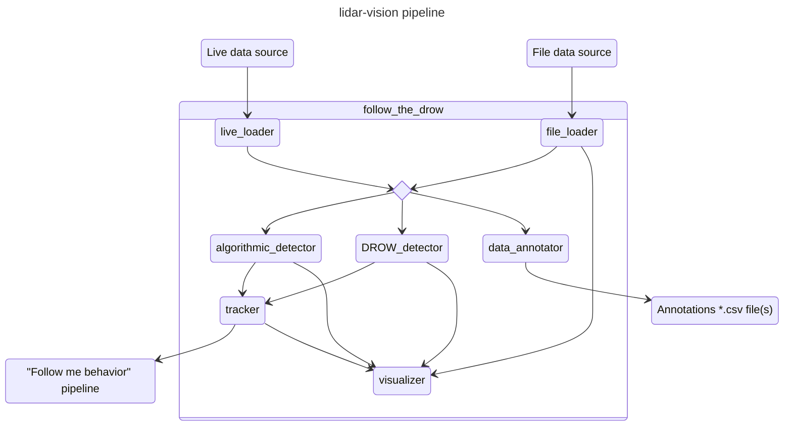

# Deployment — the ROS/Docker pipeline on RobAIR

*keywords:* ROS, Docker, RobAIR, deploy, launch-docker, conf.env, node, follow-me, not deployed

Full build/setup documentation for the Docker image is [`../docs/ROS_IMAGE.md`](../docs/ROS_IMAGE.md).
This file is the operational summary: what actually runs, and what silently doesn't.

## The one deploy command

```bash
make launch-docker-local            # laptop only, ROBAIR_IP forced to 127.0.0.1
make launch-docker-robot            # against the real robot, default ROBAIR_IP=192.168.1.201
```

Both run `docker compose -f deploy/docker/docker-compose.yml up --force-recreate roslaunch`, which rebuilds the ROS package from whatever is on disk in `deploy/follow_the_drow/` at that moment — there is no CI auto-deploy step; a code change reaches the robot only when someone runs one of these commands by hand.
`make build-image` builds the underlying Docker image (also built by CI on pushes touching `deploy/docker/**`, `library/**`, or the `Makefile`); it does not launch anything.

## What actually runs today

Only `DrowDetector` — the published DROW cutout network — is wired into any ROS node.
None of this project's newer work (`SpaceTimeCNNDetector`/`FullScanTCNDetector`/`TemporalUNetDetector`, the real-odometry pipeline, `SimpleTracker`) has ever been integrated into a ROS node; reaching the robot with any of them needs real node-integration work, not just training-side work.
Node enable/disable, topic names, and every tuning constant go through `deploy/conf.env` — see the file itself for the full variable list, and `dos-and-donts.md` for why it shouldn't be tuned against the live robot.



| Node | Role | Silent-failure note |
| --- | --- | --- |
| `live_loader` | Ingests `scan`/`scan2`/`odom` topics, aggregates top+bottom lidar, publishes `raw_data`. | Disabled by default (`LIVE_LOADER=false`) — a robot session with it off silently has no live sensor input, only file replay. |
| `file_loader` | Replays a DROW-format split (default `test`) as `raw_data` + annotations every 5th scan. | — |
| `visualizer` | Publishes everything to RVIZ; `flatten` zeroes the z-coordinate. | — |
| `algorithmic_detector` | Runs the C++ `AlgorithmicDetector`, **prof. O. Aycard's algorithm** (`detector-architectures.md`). 13 tunable constructor params in `conf.env`. | Its source is duplicated between `library/cpp_core/` and `deploy/follow_the_drow/src/` — see `dos-and-donts.md`. |
| `DROW_detector` | Runs the published DROW network. `threshold` (default 0.80) + `persons_only`. | No GPU on the laptop or RobAIR -> runs at ~1 Hz, not the paper's real-time rate. |
| `data_annotator` | RVIZ-driven manual re-annotation. | Must run exclusive of every other node. |
| `tracker` (`PersonTracker`) | Tracks one person from one detector's output; policies `first`/`closest`/`tracked`/`none`. | Always publishes a position — falls back to robot-local `(0,0)` when nothing is tracked, which looks like a valid detection if not checked. |

Debug builds default to `RelWithDebInfo` with GDB available (`deploy/follow_the_drow/CMakeLists.txt`); attach with `launch-prefix="gdb -batch -ex run -ex bt --args"`.

## Notes specific to RobAIR

- RobAIR's own LiDAR: 725 rays, ~255 deg FoV.
  Camera FoV is narrower (rays 315-430).
- DROW's paper used 12.5 Hz; this deployment runs the node at 10 Hz for compatibility.
